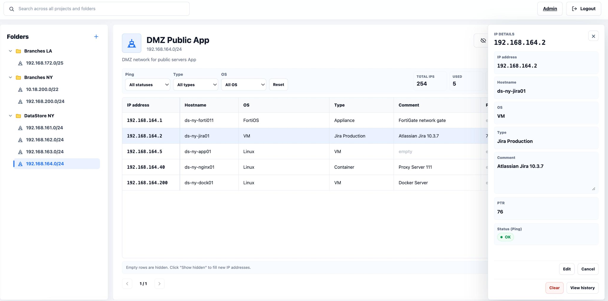

# IPtable

IPtable - простое веб-приложение для учета IP-адресов и устройств в локальной сети.
Создавайте папки и подсети, заполняйте данные об устройствах и отслеживайте их
доступность. Вся информация хранится в PostgreSQL вместо разрозненных Excel-файлов.

## Возможности

- Папки и проекты-подсети с автоматическим списком IP-адресов.
- Hostname, OS, Type, Comment и собственные столбцы с настройкой типа и порядка.
- Проверка доступности по ping сразу после создания подсети и по расписанию.
- Поиск по всем проектам, фильтры по ping, OS и Type.
- Скрытие пустых адресов, удобное редактирование и история изменений.
- Импорт и экспорт CSV/XLSX, экспорт папки в архив с возможностью задать пароль.
- Пользователи и права доступа через админ-панель.
- Русский и английский интерфейс, REST API для интеграций.



## Установка

Нужны Git, Docker и Docker Compose.

```bash
git clone https://github.com/lasnet/IPTable.git
cd IPTable
```

Откройте `docker-compose.yml`. В начале файла заполните три пустых параметра:
`POSTGRES_PASSWORD`, `SECRET_KEY` и `INITIAL_ADMIN_PASSWORD`.
Значение вида `${SECRET_KEY:-}` можно заменить своей строкой в кавычках.
Для `SECRET_KEY` используйте случайную строку длиной от 32 символов,
для пароля администратора - от 12 символов.

Затем запустите:

```bash
docker compose up -d --build
```

Откройте **http://IP-адрес-сервера:8000** (на самой машине —
**http://localhost:8000**). Логин по умолчанию - `admin`,
пароль - тот, который вы указали в `INITIAL_ADMIN_PASSWORD`.
База, миграции и ping-worker запускаются автоматически. По умолчанию Nginx
не запускается, сертификаты не требуются. HTTP не шифрует пароли и cookie;
для доступа через интернет включите HTTPS или используйте свой HTTPS proxy.

Вместо редактирования Compose можно скопировать `.env.example` в `.env`
и заполнить те же настройки там. Настройки из `.env` используются в выражениях
`${ИМЯ_ПАРАМЕТРА:-значение}`; не храните настоящий `.env` в Git.

### HTTPS через ваш общий Nginx

На сервере приложения в `.env`:

```dotenv
HTTPS_ENABLED=false
APP_PUBLIC_URL=https://iptable.example.com
APP_PORT=8000
TRUSTED_PROXY_IPS=192.168.1.10
```

Встроенный Nginx не нужен. На общем Nginx настройте сертификат и перенаправление
HTTP → HTTPS, а в HTTPS server — upstream приложения:

```nginx
location / {
    proxy_pass http://192.168.1.20:8000;
    proxy_set_header Host $http_host;
    proxy_set_header X-Forwarded-Proto https;
    proxy_set_header X-Forwarded-For $remote_addr;
}
```

Замените адреса своими. `TRUSTED_PROXY_IPS` — IP общего Nginx, видимый контейнеру,
или его доверенная подсеть. Ограничьте доступ к порту приложения этим прокси
через правила сети/Docker firewall. Если прокси на том же хосте, можно задать
`APP_BIND_ADDRESS=127.0.0.1`. Приложение не подключается к прокси само; Secure cookie
и HSTS включаются по `APP_PUBLIC_URL`, остальные production-проверки сохраняются.

### Встроенный HTTPS по выбору

Нужен Docker Compose **2.24.4+**, DNS-имя/IP и выданный для него сертификат.
Скопируйте `.env.example` в `.env`, заполните секреты и настройки:

```dotenv
HTTPS_ENABLED=true
COMPOSE_PATH_SEPARATOR=:
COMPOSE_FILE=docker-compose.yml:deploy/https/${HTTPS_ENABLED:-false}.yml
APP_PUBLIC_URL=https://iptable.example.com
TLS_SERVER_NAME=iptable.example.com
APP_PORT=8000
HTTPS_PORT=443
TLS_CERT_FILE=/srv/iptable/tls/fullchain.pem
TLS_KEY_FILE=/srv/iptable/tls/privkey.pem
TLS_KEY_GID=0
```

Запуск остаётся прежним: `docker compose up -d --build --remove-orphans`.
`COMPOSE_FILE` выбирает HTTPS-фрагмент по переключателю; сохраняйте эту строку
из примера. Один `HTTPS_ENABLED=true` без этой строки не добавляет сервис Compose.
Пути сертификатов абсолютные, на машине Docker Engine. Сертификат — PEM с цепочкой,
ключ — соответствующий PEM без парольной фразы; оба подключаются только для чтения.
Скрипт проверяет читаемость, срок, имя и соответствие ключа сертификату. Nginx
работает с UID 101 и дополнительной группой `TLS_KEY_GID`. Например, для root-owned
ключа с группой root используйте `TLS_KEY_GID=0` и права `640`; не делайте ключ
общедоступным. Родительский каталог не монтируется.

Сертификаты не генерируются автоматически. Для собственного CA добавьте его
публичный корень в доверие клиентских устройств. Для обновления замените файлы
и выполните `docker compose up -d --force-recreate gateway`; это также обновляет
bind mount при атомарной замене файлов. Закрытые ключи в Git не добавляйте.

Приложение доступно на HTTPS-порту, HTTP на `APP_PORT` перенаправляется на
`APP_PUBLIC_URL` с сохранением пути и параметров. HTTP, ошибочно отправленный на
HTTPS-порт, также перенаправляется. Если порт HTTPS не 443, укажите его и в URL,
например `https://iptable.example.com:8443`. Версия Nginx скрыта в заголовках и
страницах ошибок. Внутренний порт web при этом не публикуется.

Для возврата к HTTP задайте `HTTPS_ENABLED=false` и HTTP `APP_PUBLIC_URL`, затем
`docker compose up -d --build --remove-orphans`: лишний gateway будет удалён.
База и её том сохраняются. После ранее включённого HSTS браузер может продолжать
принудительно использовать HTTPS до истечения политики; изменение конфигурации
не очищает сохранённую браузером политику.

## Настройки

Параметры запуска находятся в `docker-compose.yml` или `.env`. После первого запуска
администратор меняет параметры ping, безопасности, импорта и API-токен
на странице **Настройки**. При первом запуске прежние значения из окружения
однократно переносятся в базу данных. Последующие изменения этих переменных в
`.env` не заменяют значения в базе. Для изменения портов, HTTPS, базы данных и
начальной учетной записи администратора по-прежнему используйте Compose или `.env`.

Раздел **Настройки → Интерфейс** доступен каждому пользователю. В нём можно
выбрать синюю, зелёную или тёмную тему, язык интерфейса и количество строк
на странице таблицы. Выбор хранится в аккаунте и действует после повторного входа.
Вариант «По умолчанию» использует общие значения установки, включая значения,
сохранённые до перехода на личные настройки. Остальные разделы видит только
администратор. Название приложения и значения интерфейса по умолчанию можно
изменить с сервера командой `app.manage settings set --group interface`.

При обновлении старой установки с env-настройками сделайте резервную копию БД,
остановите старые `web` и `worker`, затем выполните привычный
`docker compose up -d --build`. Сервис `migrate` обновит схему и перенесет
настройки до запуска новых процессов. Не запускайте одновременно старую и новую
версию приложения с одной базой. Для возврата к старой версии потребуется
восстановить согласованную копию БД и прежнюю конфигурацию; старый код не читает
новые настройки из БД.

| Параметр | По умолчанию | Описание |
| --- | --- | --- |
| `POSTGRES_PASSWORD` | пусто | Обязательный пароль базы данных. |
| `SECRET_KEY` | пусто | Обязательный случайный ключ сессий, от 32 символов. Сохраните его при обновлениях. |
| `INITIAL_ADMIN_USERNAME` | `admin` | Логин администратора. |
| `INITIAL_ADMIN_PASSWORD` | пусто | Пароль администратора при первом запуске, от 12 символов. |
| `APP_PORT` | `8000` | HTTP-порт; во встроенном HTTPS — порт перенаправления. |
| `HTTPS_ENABLED` | `false` | Встроенный HTTPS; требует строки COMPOSE_FILE из примера env. |
| `APP_PUBLIC_URL` | `http://localhost:8000` | Внешний HTTP(S)-адрес без пути; HTTPS включает Secure cookie и HSTS. |
| `HTTPS_PORT` | `443` | Порт встроенного HTTPS. |
| `TLS_SERVER_NAME` | пусто | DNS-имя/IP сертификата, совпадающее с именем в APP_PUBLIC_URL. |
| `TLS_CERT_FILE` / `TLS_KEY_FILE` | пусто | Абсолютные пути PEM-сертификата с цепочкой и ключа. |
| `TLS_KEY_GID` | `0` | Дополнительная группа Nginx для чтения ключа. |
| `TRUSTED_PROXY_IPS` | `127.0.0.1` | Доверенные адреса/CIDR внешнего прокси; не используйте `*` для открытого backend. |
| `APP_BIND_ADDRESS` | `0.0.0.0` | Адрес прослушивания; `127.0.0.1` ограничит доступ самим сервером. |
| `APP_NAME` | `IPtable` | Название приложения. |
| `INTERFACE_LANGUAGE` | `RU` | Язык интерфейса: `RU` или `EN`. |
| `INTERFACE_THEME` | `blue` | Начальное оформление при создании настроек: `blue`, `green` или `dark`. |
| `POSTGRES_USER` / `POSTGRES_DB` | `iptable` | Пользователь и название базы. |
| `SESSION_IDLE_TIMEOUT_SECONDS` | `86400` | Завершение сессии после указанного числа секунд бездействия. |
| `LOGIN_RATE_LIMIT_ATTEMPTS` | `5` | Сколько неудачных попыток входа допускается за окно ограничения. |
| `LOGIN_RATE_LIMIT_WINDOW_SECONDS` | `300` | Длина окна ограничения входа в секундах. |
| `LOGIN_RATE_LIMIT_LOCKOUT_SECONDS` | `900` | Время блокировки входа в секундах. |
| `PING_INTERVAL_SECONDS` | `3600` | Интервал проверки адресов в секундах. Для папок и проектов можно задать расписание в интерфейсе. |
| `PING_TIMEOUT_SECONDS` | `2` | Сколько секунд ждать ответа одного адреса. |
| `PING_CONCURRENCY` | `8` | Максимум одновременных ping внутри одного worker. |
| `PING_BATCH_SIZE` | `32` | Сколько адресов проверять одним пакетом. |
| `PING_BATCH_PAUSE_SECONDS` | `1` | Пауза между пакетами. |
| `PING_PROJECT_PAUSE_SECONDS` | `5` | Пауза между подсетями. |
| `PING_QUEUE_POLL_SECONDS` | `5` | Интервал чтения очереди worker. |
| `PING_RUNNING_JOB_TIMEOUT_SECONDS` | `7200` | Когда возвращать зависшую ping-задачу в очередь. |
| `PROJECT_TABLE_DEFAULT_PAGE_SIZE` | `25` | Количество строк на странице таблицы. |
| `MAX_PROJECT_ADDRESSES` | `4096` | Максимум адресов в одной подсети. |
| `CSV_IMPORT_MAX_BYTES` | `2097152` | Максимальный размер CSV/XLSX-файла в байтах. |
| `INTEGRATION_API_TOKEN` | пусто | Токен REST API. Без него API отключен. |
| `APP_ENV` | `production` | Рабочий режим с отключенными Swagger/OpenAPI; `local` используется при разработке. |
| `DATABASE_URL` | пусто | Необязательное подключение к существующей БД. Для встроенной PostgreSQL заполнять не нужно. |

Параметры `APP_NAME`, `INTERFACE_LANGUAGE`, `INTERFACE_THEME`, `SESSION_IDLE_TIMEOUT_SECONDS`,
`LOGIN_RATE_LIMIT_*`, `PING_*`, `PROJECT_TABLE_DEFAULT_PAGE_SIZE`,
`MAX_PROJECT_ADDRESSES`, `CSV_IMPORT_MAX_BYTES` и `INTEGRATION_API_TOKEN` в таблице
выше являются начальными значениями для импорта. В разделе «Настройки»
администратору видны общие параметры безопасности, ping, лимитов, интеграций
и последние изменения. Общий интервал ping применяется к
новым расписаниям; расписания существующих папок и проектов сохраняются.
Новый API-токен показывается только при создании или замене. После восстановления
резервной копии проверьте доступ интеграций: в ней может быть прежний токен.

Пароли и логин при первом запуске создают учетные записи.
Изменение `INITIAL_ADMIN_PASSWORD` или `POSTGRES_PASSWORD` в конфигурации
не меняет пароль уже созданного пользователя или базы. В разделе
«Пользователи» администратор может найти аккаунт, открыть его профиль
с историей изменений IP-адресов, изменить права или задать новый пароль.
Во вкладке «Роли» доступны «Администратор» для полного доступа, «Пользователь»
для просмотра и «Редактор» с правами создавать, редактировать, удалять объекты
и управлять столбцами. Свои роли можно собрать из этих четырёх прав.
Чтобы удалить пользовательскую роль, сначала назначьте другую роль всем
аккаунтам, которые её используют.
Управление пользователями, ролями и общими настройками доступно администраторам.
При обновлении аккаунты сохраняют права, а для нестандартных наборов создаются
отдельные роли.
Выход отзывает текущую сессию. Смена пароля или отключение аккаунта отзывает
все его сессии.

## Первые шаги

Создайте папку, добавьте проект с подсетью, например `192.168.1.0/24`,
и нажмите «Показать скрытые». Нажмите на строку IP, выберите «Редактировать»
и заполните данные устройства. Статусы ping: `NoTest` - еще не проверялся,
`OK` - доступен, `NO` - не отвечает.

Строку может редактировать один пользователь за раз. Остальные могут её
просматривать и видят логин редактора. Блокировка снимается после сохранения
или закрытия карточки и автоматически истекает, если вкладка перестаёт
её продлевать.

В меню подсети откройте «Столбцы», чтобы скрыть ненужные столбцы в своей таблице.
Видимость сохраняется отдельно для каждого аккаунта и подсети. Скрытые значения
по-прежнему доступны в карточке IP.

Для импорта используйте CSV с разделителем `;` или XLSX с колонками
`ip;hostname;os;type;comment`. Строка заголовка необязательна.

## Обновление и основные команды

Перед обновлением сохраните свои настройки Compose или `.env` и сделайте резервную копию.

После этого обновления старые сессии потребуют повторного входа. Таблица сессий
добавляется обычной миграцией без удаления пользователей и инвентаризации.
Cookie HTTP и HTTPS используют разные имена: старые Secure cookie не мешают
входу после переключения на HTTP. При смене режима потребуется повторный вход.
Сохраняйте прежнее имя Compose project и volume базы. Режим доступа теперь задаёт
APP_PUBLIC_URL; APP_HOST, HTTP_PORT и ручной SESSION_COOKIE_SECURE больше не нужны
в Compose. При обновлении промежуточной версии dev с обязательным gateway выберите
режим выше, для HTTPS предоставьте свой сертификат. Старый gateway_certs не используется;
он не удаляется автоматически. Для удаления лишнего контейнера используйте --remove-orphans.

```bash
scripts/backup_postgres.sh
git pull --ff-only
docker compose build --pull
docker compose up -d --no-build --remove-orphans
```

Если настройки внесены прямо в Compose, Git может попросить объединить их с новой
версией файла. Отдельный `.env` позволяет обновлять Compose без этого конфликта.

```bash
docker compose ps              # состояние сервисов
docker compose logs -f web     # логи приложения
docker compose logs -f worker  # логи ping
docker compose down            # остановка с сохранением базы
```

Данные хранятся в Docker volume. Для восстановления из копии:

```bash
docker compose stop web worker
CONFIRM_RESTORE=YES scripts/restore_postgres.sh backups/имя_копии.dump
docker compose start web worker
```

Не используйте `docker compose down -v`, если хотите сохранить данные.
Если изменили настройки, примените их через `docker compose up -d`.

Лицензия: [MIT](LICENSE).
